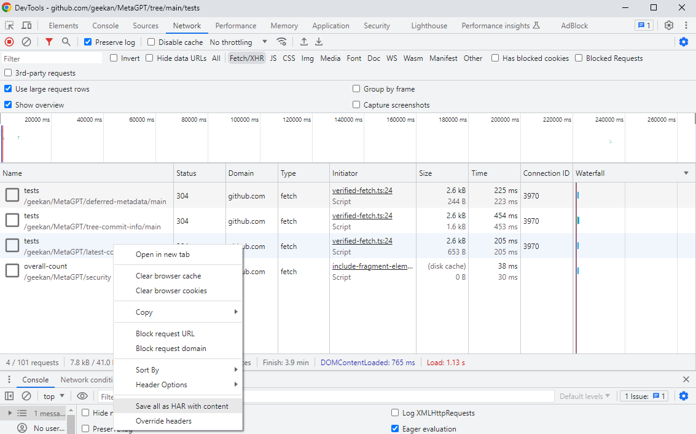

# Extract data from browser responses via har files

## Prerequisites

- Python (3.6 or later)
- `haralyzer` library (`pip install haralyzer`)

## Step 1
Save network requests as har files with content 



Move the har file(s) in the script directory


## Step 2 
Run the script 

```bash
python har_parser.py
```

### To capture and parse browser network requests without har files directly from python follow [this tutorial]() 
